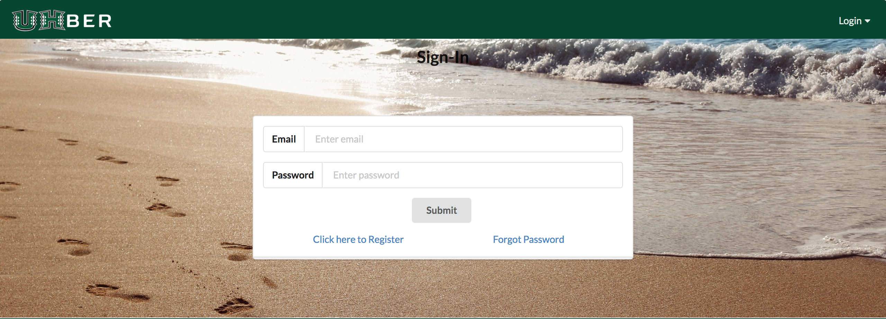
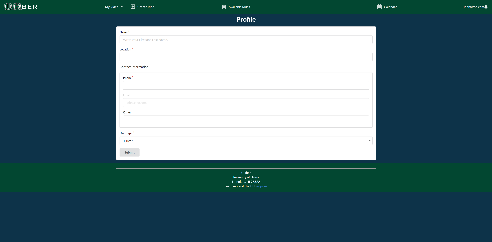

## Table of Contents

* [Overview](#overview)
* [Links](#links)
* [Walkthrough](#walkthrough)
* [Community Feedback](#community-feedback)
* [Developer Guide](#developer-guide)
* [Team](#team)

## Overview

The UHBer website aims to provide a user-friendly way to organize carpools for those traveling to/from the UH Manoa campus. The main idea of this project is to have two groups of users, Drivers and Riders. Drivers would be the people that will be driving and Riders will be the people that are riding the car. There will be a score system where you will pay with points. If you want to refill your points, you will need to drive. 

## Links

* [UHber Webpage](http://uhber.meteorapp.com/#/)
* [UHber Organization Page](https://github.com/UHBer/)
* [Milestone 1](https://github.com/UHBer/UHBer/projects/1)
* [Milestone 2](https://github.com/UHBer/UHBer/projects/2)
* [Milestone 3](https://github.com/UHBer/UHBer/projects/3)

## Walkthrough

In order to view the current capabilities of the UHber website, the user should log in with the username: John@foo.com and password: changeme. Upon visiting the UHber website, the user first sees the landing page below. The new users may choose to sign-up and returning users may choose to sign-in using the drop-down menu in the upper left corner of the website. 

### Landing Page

This is the [landing page](http://uhber.meteorapp.com/#/) that users first see when they visit the site. 

### Sign-In Page

This is the basic [signin page](http://uhber.meteorapp.com/#/signin).

### Sign-Up Page 

This is the [signup page](http://uhber.meteorapp.com/#/signup), we wanted to make the user input their names when they sign up just so their names would be on their profile until they decide to make their profile.

### User Landing Page

Once the user has logged in, they will be able to view the user landing page which permits them to access more options in the navbar.

### User Profile 
From the user landing page, the user may view their profile via the dropdown menu in the upper left corner. When on the profile page, the user has the ability to change their name, home city location, phone number, other forms of communication, and user type (whether they prefer to be a driver, rider, or both). As the users will ultimately be UH students, their email is uneditable as they must use their UH email when signing up for UHber. Once the user submits their input, their information is saved until they decide to re-edit it.



## Available Rides
Users can view the rides available by accessing the "Available Rides" tab. Using the search bar, the user can enter their desired city to view rides associated with it.


## Community Feedback 


## Developer Guide
A small tutorial on how to run this application into your local machine.

### Requirements
* [Meteor](https://www.meteor.com/install)
* [MongoDB](https://www.mongodb.com/)
* [Copy of UHBer Repository](https://github.com/UHBer/UHBer)

### Installation
Using a shell program, for example, cmd; navigate to the app directory and run the following commands:

```
$ meteor npm install
```

### Running the program
Using a shell program, for example, cmd; navigate to the app directory and run the following commands:

```
$ meteor npm run start
```

Now, open your desire browser and go to [http://localhost:3000](http://localhost:3000)


## Team

* [Marie Beth Calamasa](https://github.com/mcalamasa) (Web Developer)
* [Dylan Decker](https://github.com/dylandecker) (Web Developer)
* [Frendy Lio](https://github.com/frendylio) (Web Developer)
* [Kelsey Fukushima](https://github.com/kryf) (Web Developer)
