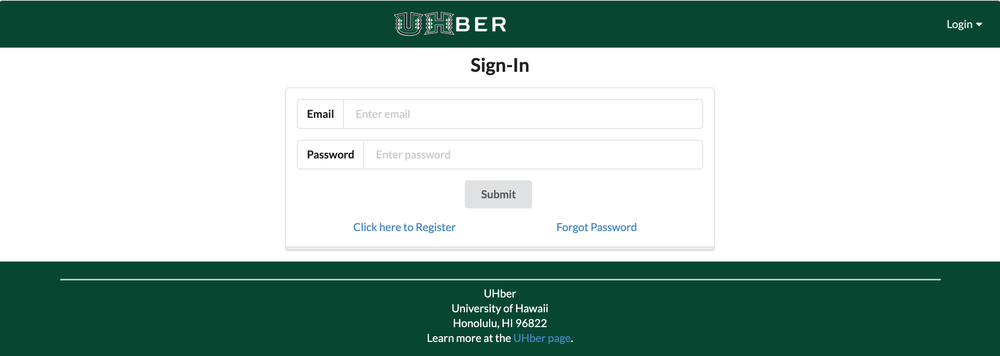

## Table of Contents

* [Overview](#overview)
* [Links](#links)
* [Walkthrough](#walkthrough)
* [Team](#team)

## Overview

The UHBer website aims to provide a user-friendly way to organize carpools for those traveling to/from the UH Manoa campus. The main idea of this project is to have two groups of users, Drivers and Riders. Drivers would be the people that will be driving and Riders will be the people that are riding the car. There will be a score system where you will pay with points. If you want to refill your points, you will need to drive. 

## Links

* [UHber Webpage](http://uhber.meteorapp.com/#/)
* [UHber Organization Page](https://github.com/UHBer/)
* [Deployment on Galaxy](https://galaxy.meteor.com/app/uhber.meteorapp.com)
* [Milestone 1](https://github.com/UHBer/UHBer/projects/1)
* [Milestone 2](https://github.com/UHBer/UHBer/projects/2)
* [Milestone 3](https://github.com/UHBer/UHBer/projects/3)

## Walkthrough

UHber will have several pages for the user to navigate through to ensure this app provides its users an easy way to create and maintain carpools. For now there are mock ups of the basic pages.

### Landing Page

This is the [landing page](http://uhber.meteorapp.com/#/) that users first see when they visit the site. 
### Sign In Page Mockup

This is the basic [signin page](http://uhber.meteorapp.com/#/signin).
### Sign Up Page Mockup

This is the [signup page](http://uhber.meteorapp.com/#/signup), we wanted to make the user input their names when they sign up just so their names would be on their profile until they decide to make their profile.
### User Landing Page Mockup

This is the home page when the user logs in. Its the same as the regular landing page, but it provides the user with more options in the navbar.
### User Profile page Mockup

This is the user's profile page. We might change it depending on what we want other users to see when they look at another users profile.

## Team

* [Marie Beth Calamasa](https://github.com/mcalamasa) (Web Developer)
* [Dylan Decker](https://github.com/dylandecker) (Web Developer)
* [Frendy Lio](https://github.com/frendylio) (Web Developer)
* [Kelsey Fukushima](https://github.com/kryf) (Web Developer)

## Developer Guide
A small tutorial on how to run this application into your local machine.

### Requirements
* [Meteor](https://www.meteor.com/install)
* [MongoDB](https://www.mongodb.com/)
* [Copy of UHBer Repository] (https://github.com/UHBer/UHBer)

### Installation
Using a shell program, for example, cmd; navigate to the app directory and run the following commands:

```
$ meteor npm install
$ npm install react-avatar --save
$ npm install prop-types --save
```

### Running the program
Using a shell program, for example, cmd; navigate to the app directory and run the following commands:

```
$ meteor npm run start
```

Now, open your desire browser and go to [http://localhost:3000](http://localhost:3000)
